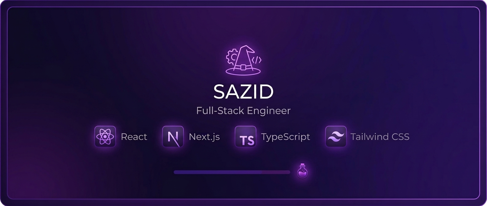

  

# Hey there, I'm Sazid 🧙‍♂️

Transforming code into magical spells 🪄 & brewing high‑performance type‑safe web apps with **React.js** and **Next.js** — always with a dash of Felix Felicis! 🔮  

---

### 🔧 Tech Stack

**Languages**  

**Frameworks & Styling**  

**Tools & Hosting**  

---

### 📊 GitHub Stats

  
  
  

---

### 🐍 Contribution Snake

  <picture>
    <source media="(prefers-color-scheme: dark)" srcset="https://raw.githubusercontent.com/sazidbinmostafa/sazidbinmostafa/output/github-contribution-grid-snake-dark.svg">
    <source media="(prefers-color-scheme: light)" srcset="https://raw.githubusercontent.com/sazidbinmostafa/sazidbinmostafa/output/github-contribution-grid-snake.svg">
    
  </picture>

---

### 📬 Connect With Me

 
